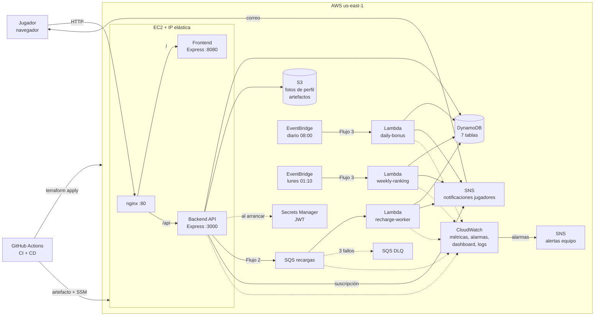

# FrioMx -- High Level Design (HLD)

Versión 1.0, 8 de octubre de 2026. Requerimientos en `01-requerimientos.md`, detalle en `03-LLD.md`.

## 1. Resumen

FrioMx corre en una sola instancia EC2 que sirve el frontend y el backend detrás de nginx en el mismo origen. Los datos viven en DynamoDB, las fotos de perfil en S3 y el secreto de firma de sesiones en Secrets Manager. La recarga de fichas pasa por una cola SQS que consume una Lambda. El bono diario y el cierre del ranking semanal son Lambdas disparadas por reglas programadas de EventBridge. SNS manda correos a jugadores y alertas al equipo. CloudWatch concentra métricas, alarmas y el dashboard. Terraform crea todo y GitHub Actions prueba y despliega en cada merge a `main`.

## 2. Contexto

La aplicación base ya resuelve la experiencia de juego: páginas web, API REST con autenticación por token y la mecánica de los tres juegos. Para este proyecto se le agregan tres cosas. Primero, una capa de datos en DynamoDB que sustituya a MongoDB y la infraestructura de AWS de FrioMx. Segundo, los flujos asíncronos y programados. Tercero, el endurecimiento de reglas que hoy dependen del cliente. Hoy el cliente manda su propio id de usuario, existe una ruta que suma cualquier monto al saldo, el juego de minas lo decide el navegador, en hi-lo la carta que ve el jugador no es la que compara el servidor y los pagos de hi-lo le dan al jugador valor esperado positivo, lo que inflaría el ranking. El diseño cierra esas brechas como parte de la migración.

## 3. Arquitectura

## 4. Componentes

**nginx en EC2.** Recibe todo el tráfico en el puerto 80. Manda `/api/*` al backend y el resto al frontend. Así el navegador habla con un solo origen y no se necesita CORS.

**Frontend.** El servidor Express de la base, que entrega HTML, CSS y JavaScript estáticos. Las páginas de juego se mantienen. Cambian las llamadas a la API, la página de saldo (recargas en lugar de pagos) y minas. Se agrega una página de ranking.

**Backend API.** Express con Node.js 22. Valida la entrada, verifica el token, ejecuta la lógica de juego y escribe en DynamoDB con transacciones. Publica la solicitud de recarga en SQS y crea la suscripción de correo del jugador en SNS. Envía métricas propias a CloudWatch.

**DynamoDB.** Siete tablas en modo bajo demanda: usuarios, índice de correos, historial, estadística semanal, recargas, rondas abiertas de hi-lo y minas, y ranking cerrado. Las escrituras de saldo son condicionales y transaccionales.

**S3.** Un bucket privado para fotos de perfil, que se leen con URLs firmadas. Un bucket para artefactos de despliegue y otro para el estado de Terraform.

**Secrets Manager.** Guarda el secreto con el que se firman los tokens. El backend lo lee una vez al arrancar.

**SQS + Lambda recharge-worker.** Cola estándar con cola de fallidos tras 3 intentos. La Lambda acredita las fichas de forma idempotente y avisa al jugador.

**EventBridge + Lambdas daily-bonus y weekly-ranking.** Dos reglas con expresión cron. Una acredita el bono diario a jugadores activos. La otra cierra la semana, guarda el top 3, entrega premios y avisa a los ganadores.

**SNS.** Un tema para jugadores. Cada jugador se suscribe con su correo y un filtro, así cada mensaje le llega solo a su destinatario. Otro tema para alertas del equipo.

**CloudWatch.** Logs de backend y Lambdas, métricas propias y de servicio, 2 alarmas y 1 dashboard.

**GitHub Actions.** CI en cada pull request: pruebas, cobertura y validación de Terraform. CD en cada merge a `main`: pruebas, `terraform apply`, artefacto a S3 y despliegue en EC2 con SSM Run Command.

## 5. Flujos

**Flujo 1, jugar.** El navegador manda la apuesta. El backend toma el usuario del token, valida monto y jugada, genera el resultado con un generador criptográfico y ejecuta una sola transacción. Esa transacción cambia el saldo con la condición de que alcance, agrega la entrada de historial y suma la ganancia semanal. Si la condición falla responde "fondos insuficientes" sin tocar nada. Hi-lo y minas son de varios pasos. En hi-lo el reparto cobra la apuesta y guarda la carta visible como ronda abierta, y la jugada la resuelve y paga. En minas iniciar cobra la apuesta y guarda el tablero en el servidor, cada destape lo resuelve el servidor y la partida termina al pisar una mina o al destapar todas las casillas seguras. En Fase 2 minas corre con una versión temporal que registra el resultado que reporta el navegador, ya sobre DynamoDB y con el usuario del token. La versión en el servidor llega en la etapa siguiente.

**Flujo 2, recargar.** El backend valida el paquete. En una transacción incrementa el contador diario del jugador y crea la recarga como pendiente, con un id derivado de una clave de idempotencia que manda el navegador. Luego encola el id y responde 202. La Lambda marca la recarga como completada y suma las fichas en una transacción condicionada al estado pendiente, así un mensaje repetido no acredita dos veces. Después publica el correo. El navegador consulta el estado hasta verlo completado. Si un mensaje falla 3 veces pasa a la cola de fallidos y dispara una alarma al equipo. Una recarga que sigue pendiente 5 minutos después de creada se muestra como fallida.

**Flujo 3, bono y ranking.** Cada partida del flujo 1 ya sumó la ganancia neta del jugador en la tabla semanal. El jugador consulta el ranking en curso y el de la semana pasada desde la aplicación. A las 08:00 la regla diaria invoca daily-bonus, que recorre a los jugadores activos y acredita 100 fichas a cada uno con condición de no haberlo hecho hoy. El lunes a la 01:10, cuando ya expiraron las partidas abiertas de la semana, la regla semanal invoca weekly-ranking. Esta lee la semana anterior, ordena, y en una transacción guarda el resultado (solo si no existe) y acredita los tres premios. Luego avisa a los ganadores.

## 6. Datos

| Tabla | Llave | Contenido |
|---|---|---|
| users | userId | perfil, hash de contraseña, saldo, fechas de actividad, bono y recargas del día |
| user-emails | email | userId, garantiza correo único |
| activity | userId + fecha#partida | historial de partidas |
| weekly-stats | semana + userId | ganancia neta y partidas de la semana |
| recharges | rechargeId | paquete, estado, fechas |
| game-rounds | gameId | rondas abiertas de hi-lo (carta visible) y minas (tablero oculto, casillas destapadas), estado, expiran en 1 hora |
| leaderboard | semana | top 3 cerrado y premios |

No hay datos que migrar desde la base anterior. Se arranca con tablas vacías y un script de datos de prueba.

## 7. Seguridad

- El usuario se toma solo del token. Se eliminan las rutas que aceptan un id del cliente y la que sumaba un monto arbitrario al saldo.
- Saldo solo modificable por jugadas, recargas, bono y premios, siempre con escrituras condicionales.
- Resultados aleatorios generados en el servidor con `crypto.randomInt`. Minas se resuelve en el servidor.
- Contraseñas con bcrypt. Límite de intentos en login y registro. Cabeceras seguras con helmet en la API.
- Secreto de tokens en Secrets Manager. Ningún secreto en el repositorio ni en el estado del navegador más allá del token.
- Bucket de fotos privado con bloqueo de acceso público y URLs firmadas.
- Grupo de seguridad de EC2 con solo el puerto 80 abierto. La administración se hace por SSM, sin SSH abierto.
- Limitación aceptada del entorno: no hay HTTPS porque el lab no ofrece dominio ni certificado. Las fichas no tienen valor, lo que acota el riesgo.

## 8. Observabilidad

Las 5 métricas son: partidas jugadas por juego, latencia p95 de la API, errores 5xx de la API, antigüedad del mensaje más viejo en la cola de recargas y errores de las Lambdas (incluidos los fallos de recarga, que se cuentan con una métrica propia). Las 2 alarmas son: 5 o más errores 5xx en 5 minutos, y al menos un mensaje en la cola de fallidos. Ambas avisan al equipo por SNS. El dashboard muestra esas métricas más CPU de EC2, recargas completadas, bonos entregados y profundidad de la cola de fallidos.

## 9. CI/CD

Se trabaja en ramas `feature/*` con pull request a `main` y al menos una revisión. El CI corre en cada pull request: instala dependencias, corre pruebas con un umbral de cobertura que empieza en 0 y sube por etapas hasta 70% antes de la sesión del 12 de noviembre, `terraform fmt` y `terraform validate`. Al hacer merge, el CD repite las pruebas, aplica Terraform, empaqueta backend y frontend, sube el paquete a S3 y ordena a la instancia por SSM descargarlo, cambiar de versión y reiniciar. Si la verificación de salud falla, la instancia regresa a la versión anterior. Las credenciales del lab viven como secretos de GitHub y se renuevan en cada sesión con un script. Antes de que el CD esté listo se despliega con un script que hace los mismos pasos y se ejecuta a mano.

## 10. Decisiones técnicas

| Decisión | Alternativa descartada | Motivo |
|---|---|---|
| EC2 con nginx para frontend y backend | Lambda + API Gateway, ECS | La API es un servidor Express con estado de arranque. En EC2 corre sin reescribirla. ECS añade complejidad que el lab acota. |
| Mismo origen detrás de nginx | Frontend en S3 con sitio estático | Evita CORS y conserva las rutas limpias del frontend (`/roulette`, `/hi-lo`). |
| DynamoDB | RDS | Escrituras condicionales y transacciones resuelven la integridad del saldo sin administrar un servidor de base de datos ni conexiones. El modelo de acceso es por llave. |
| SQS + Lambda para recargas | Acreditar en la misma petición | Desacopla, reintenta solo, y la cola de fallidos da una señal clara para alarmas. |
| Reglas de EventBridge con cron | EventBridge Scheduler | La regla invoca la Lambda con un permiso de recurso en la propia función, sin pasar ningún rol. Son menos piezas y no se depende de que `LabRole` confíe en el servicio de Scheduler. Las dos tareas son crons fijos, que es justo lo que resuelven las reglas. |
| SNS con filtro por jugador | SES | SNS funciona en el lab sin verificar un dominio. El filtro manda cada mensaje solo a su jugador. |
| Fichas como enteros | Decimales | Evita errores de redondeo en saldos. Los pagos con multiplicador se redondean hacia abajo. |
| Terraform con estado en S3 y bloqueo nativo | Scripts bash solamente, CloudFormation | Reproducible, con plan previo y estado compartido entre los tres. El bloqueo nativo de S3 evita una tabla extra. |
| Despliegue a EC2 con SSM Run Command | SSH desde GitHub | No abre el puerto 22 a internet ni guarda llaves privadas en GitHub. |

## 11. Riesgos

| Riesgo | Mitigación |
|---|---|
| Credenciales del lab expiran y el CD falla | Script para renovar secretos al iniciar cada sesión. Se documenta que el pipeline necesita una sesión activa. |
| La instancia se detiene al terminar la sesión | IP elástica y servicios con `systemd` que arrancan solos. Revisión de salud al inicio de la demo. |
| Un jugador no confirma el correo de SNS | El resultado del flujo 2 también es visible en la aplicación (estado y saldo). |
| Concurrencia de Lambda limitada en el lab | Concurrencia máxima de 2 en el consumidor de la cola. Las Lambdas programadas corren una vez. |
| Una sola instancia es punto único de falla | Aceptado para el alcance escolar. Recuperación con `terraform apply` y despliegue desde el pipeline. |
| Plazo corto a Fase 2 | Plan por prioridades: lo indispensable para el 80% primero, minas del lado del servidor y monitoreo después. |
